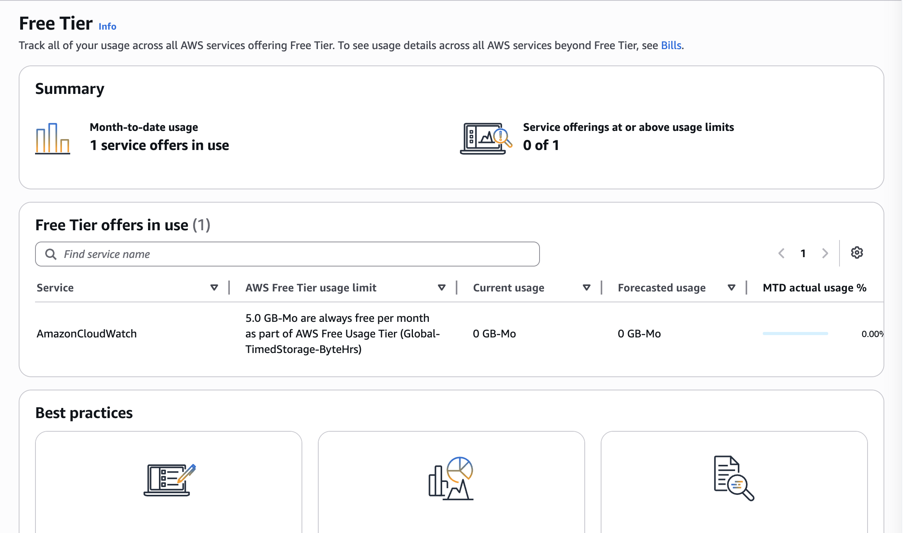
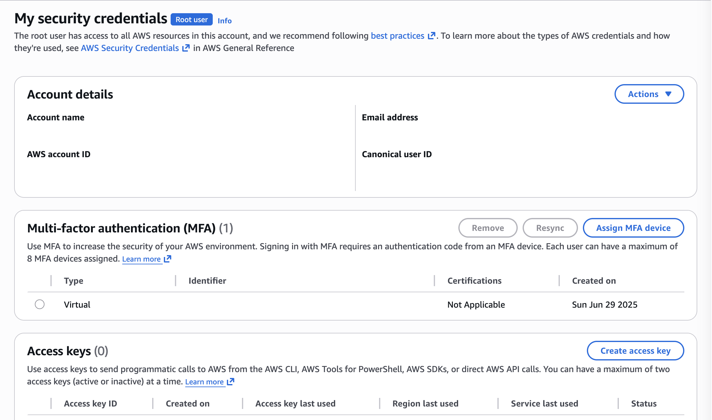
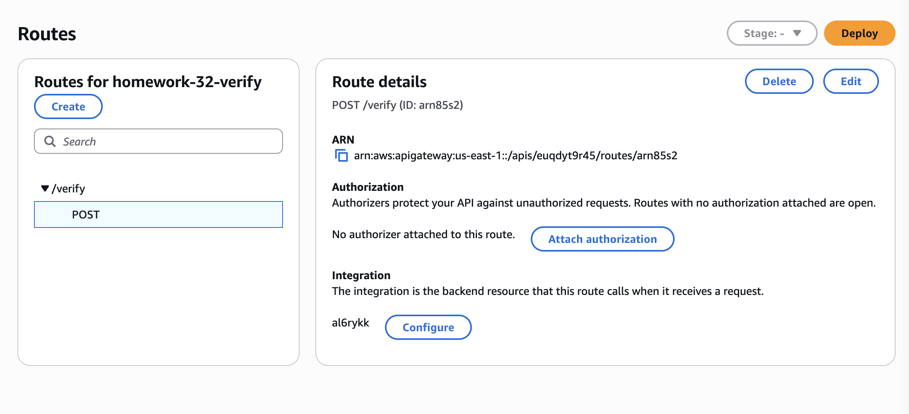
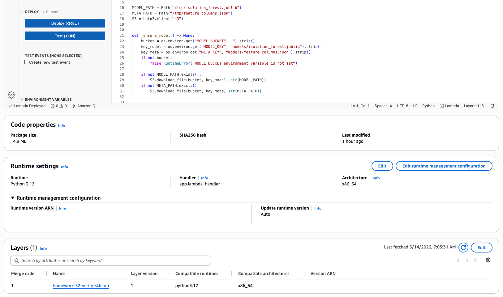
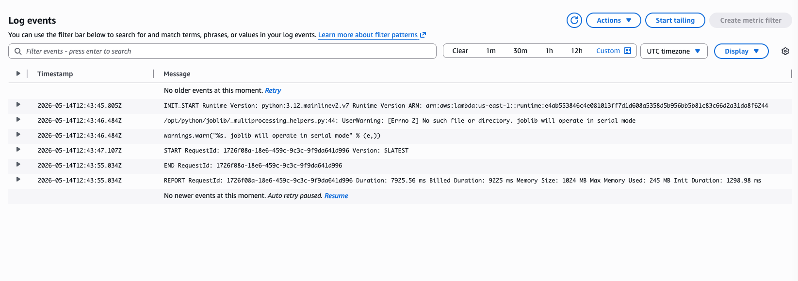
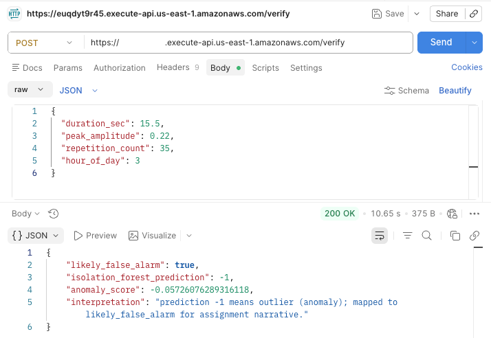
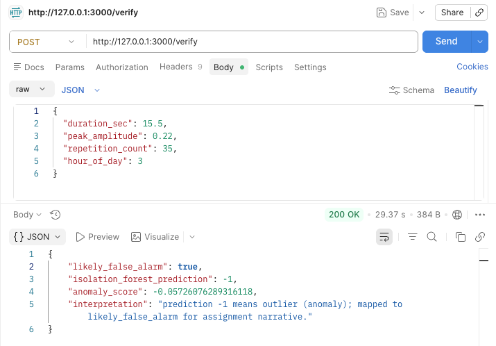

# Homework 3.2 — Submission Report (AI / Cloud / ML)

## 1. Alarm data in CSV (AI tool)

**Delivered in this repository:**

- **`data/alarms.csv`** — 2,000 rows of synthetic alarm records with columns:  
  `id`, `duration_sec`, `peak_amplitude`, `repetition_count`, `hour_of_day`, `is_false_alarm`.
- **`scripts/AI_PROMPT_FOR_ALARMS.md`** — Ready-to-paste **AI tool prompt** to regenerate or extend the dataset with explicit column definitions and realism rules.
- **`scripts/generate_alarms_csv.py`** — **Reproducible** generator (fixed RNG seed) used to create the committed CSV when a fully offline pipeline is preferred.

**Narrative:** False alarms (`is_false_alarm = 1`) skew toward shorter duration, lower peak amplitude, and higher repetition count than true alarms, with intentional overlap so learning is non-trivial.


## 2. Isolation Forest training & false-alarm identification

**Method:**

- Trained **`sklearn.ensemble.IsolationForest`** on numeric features only:  
  `duration_sec`, `peak_amplitude`, `repetition_count`, `hour_of_day`  
  (columns `id` and `is_false_alarm` excluded from training — unsupervised learning).
- **`contamination=0.12`** — prior approximate fraction of anomalies / nuisance alarms.
- **Outliers** (`predict == -1`) are treated as **anomalies**; for this assignment they are mapped in the API response to **`likely_false_alarm`** (homework narrative linking anomalies to suspicious / false-alarm-like behavior).
- Ground-truth column `is_false_alarm` is used **only** for optional offline comparison after training (not for fitting the forest).

**Script:** `train.py`


## 3. Model file on local disk

**Artifacts:**

| File                            | Description                                 |
| ------------------------------- | ------------------------------------------- |
| `model/isolation_forest.joblib` | Serialized Isolation Forest (joblib).       |
| `model/feature_columns.json`    | Feature name order for inference in Lambda. |


## 4. AWS Free Tier account

- Registered AWS account with **Free Tier** eligibility.
- Enabled **MFA** on the root or IAM admin user.
- Chose a primary **region** (e.g. `us-east-1`) for S3, Lambda, and HTTP API.




## 5. API Gateway — `POST /verify` with JSON body → Lambda

**Implementation:** AWS SAM template **`template.yaml`**

- **AWS::Serverless::Function** `VerifyFunction` with `HttpApi` event:
  - **Path:** `/verify`
  - **Method:** `POST`
- Implicit **HTTP API** (API Gateway v2) — output **`HttpApiUrl`** after deploy.



## 6. AWS SAM for local Lambda development

**Commands used:**

```bash
sam validate --region us-east-1 -t template.yaml
sam build --use-container
sam local start-api
```

**Repository files:** `template.yaml`, `events/verify-post.json`, `samconfig.toml.example`


## 7. Upload model to Amazon S3

**Procedure (after `sam deploy`):**

1. Read stack output **`ModelBucketName`**.
2. Upload artifacts:

```bash
aws s3 cp model/isolation_forest.joblib s3://<bucket>/models/isolation_forest.joblib
aws s3 cp model/feature_columns.json s3://<bucket>/models/feature_columns.json
```


## 8. Lambda layer for libraries

**Implementation:**

- Directory **`layers/sklearn/requirements.txt`** lists:  
  `numpy`, `scipy`, `scikit-learn`, `joblib` (pinned ranges compatible with Lambda Python 3.12).
- SAM resource **`SklearnLayer`** (`AWS::Serverless::LayerVersion`) with  
  `Metadata: BuildMethod: python3.12` so `sam build` installs dependencies into the layer artifact.
- Function **`VerifyFunction`** references the layer via `Layers: [!Ref SklearnLayer]`.
- Function code **`lambda/requirements.txt`** keeps **`boto3`** for S3 download (runtime also includes boto3, but explicit is fine).



## 9. Lambda loads model from S3 and serves via API Gateway

**Implementation (`lambda/app.py`):**

1. Read environment variables **`MODEL_BUCKET`**, **`MODEL_KEY`**, **`META_KEY`** (set by SAM from template defaults + bucket ref).
2. On cold start, **`boto3`** `download_file` to **`/tmp/isolation_forest.joblib`** and **`/tmp/feature_columns.json`** (cached for warm invocations).
3. Parse JSON body; build the feature vector in **`feature_columns.json`** order.
4. Return JSON with **`likely_false_alarm`**, **`isolation_forest_prediction`**, **`anomaly_score`**, and a short interpretation string.

**IAM:** SAM policy **`S3ReadPolicy`** scoped to the stack’s **`ModelBucket`**.



## 10. Test API with Postman

**Steps:**

1. **POST** `{{HttpApiUrl}}/verify`
2. Headers: `Content-Type: application/json`
3. Body (raw JSON), example:

```json
{
  "duration_sec": 15.5,
  "peak_amplitude": 0.22,
  "repetition_count": 35,
  "hour_of_day": 3
}
```

4. Expect **HTTP 200** and a JSON body including **`likely_false_alarm`**: `true` or `false`.



